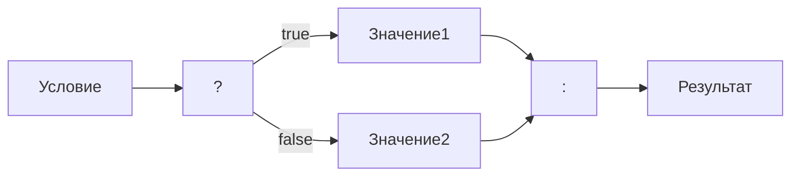

# Тернарный оператор

Тернарный, или условный оператор — [выражение](expressions.md), значение которого зависит от условия.



```C#
bool A = true;

string B = A ? "true" : "false";
```

<deflist>
<def>
<title>Пример</title>

```c#
void printEventOdd(int i){
    print("Число " + i + (i % 2 == 0 ? " чётное" : " нечётное"));
}

void [[[main|main.md]]](){
    printEventOdd(1 > 2 ? 3 : 4); // Число 4 чётное
}
```
</def>
</deflist>

> Зачастую пишут, что это сокращённая запись для [](if.md), что в корне неверно ибо тернарный
> оператор — [выражение](expressions.md) и сохраняет все его свойства, как видно из примера выше.